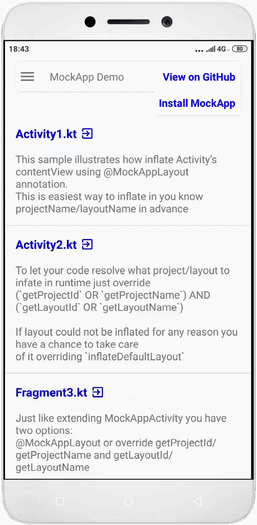

[  ](https://play.google.com/store/apps/details?id=com.crane.mockappdemo)

# MockApp Demo

This is a demo of the MockApp library used to inflate layouts created with 
[MockApp](https://play.google.com/store/apps/details?id=com.crane.mockapp) application

# Motivation

Traditionaly UI prototypes are created using great tools like zeplin, figma etc. Developer takes that assets and trying
to recreate UI using Android layout XML. If something changed cycle has to be repeated. So we have two bunches of assets: produced by designing tool and Androdi XML that needs to be in keep sync. As we all know that the shorter the dev cycle the better.

So why we couldn't experimenting with UI right in Android UI terms (Views)? When design assets become a real app assets, not just a nice pictures!

The challenge of this tool is to have one bunch of assets for design and production code.

# Usage

General steps are:
1. Design initial UI, quick sending results to the stakeholders as APK generated right from the [MockApp application](https://play.google.com/store/apps/details?id=com.crane.mockapp)
2. Use excactly the same UI in real Android Studio project. Using [ MockaApp Library  ](https://bintray.com/crane2002/maven/mockapp-core/_latestVersion) to **inflate layouts** and **bind views**
3. Make changes to the UI and see results immediately in your app

# Design time

1. Copy-paste. You can copy from any project/layout and paste it into any layout. Views will be independent from where tou take it
2. Reuse your layouts. Extract general parts of UI and reuse it. You have an ability to include layout into another layout. Any changes in the source layout will be propogated into any place you use it
3. Undo last operation
4. SVG support
5. Nine patch support
6. Gradient/Image/Tile backgtound
7. Material themes support
8. Elevation/Outline (round corners)
9. All major Android layouts: Frame, Linear, Toolbar, Scroll, Coordinator, AppBar, BottomSheet, NavigationDrawer and others
10. Full screen supported
11. Status bar coloring
12. And more...

Some design technics are highlited here [MockApp on Medium](https://medium.com/mock-app)

# Code time

## Dependencies
[  ](https://bintray.com/crane2002/maven/mockapp-core/_latestVersion)

Add dependencies
```gradle
    // required
    implementation 'com.crane:mockappcore:1.40.5'

    // optional: for auto build *.tags.txt file from classes
    // annotated with @MockAppLayout and @MockAppView
    kapt 'com.crane:mockappprocessor:1.40.5'
```

## Initialization

This step is optional. By default projects are searched in following path:
* local projects in internal storage of the device: /sdcard/Documents/MockApp
* internal projects in **assets** folder of the app: /assets/MockApp

You can get very fast dev cycle if you inflate layouts from internal storage. But production app get layouts from assets folder.

You can change local ptoject path in this way:

```kotlin
class MyApplication : Application() {
    override fun onCreate() {
        super.onCreate()

        // Optionally you can override location of the local project's storage.
        // Default is /sdcard/Documents/MockApp
        val path =
            File(Environment.getExternalStoragePublicDirectory(Environment.DIRECTORY_DOCUMENTS), "MyMockAppFolder").path
        ProjectServiceFactory.init(this, path)
    }
}
```
## Inflate layout using MockAppActivity

`MockAppActivity` do a lot of useful things: coloring status and nav bars, controls full screen mode, inflate bottom sheet and nav drawer for you, apply themes. At this moment it is very recommend to inherit your activity from it. But you still able to inflate layout without it with several lines of code (see Inflate layout in general).

### [Activity1.kt](app/src/main/java/com/crane/mockappdemo/sample1/Activity1.kt)

If you know project/layout name in advance you can use annotation `@MockAppLayout`

```kotlin
@MockAppLayout(projectName = "icountries", layoutName = "view_country")
class Activity1 : MockAppActivity() {
}
```

Just start `Activity1` and you get ready to use UI loaded from [view_country.json](app/src/main/assets/MockApp/icountries/view_country.json)

OR 

if your app has READ_EXTERNAL_STORAGE permission and file `/sdcard/Documents/MockApp/icountries/view_country.json` exists then layout will be inflated from this location

### [Activity2.kt](app/src/main/java/com/crane/mockappdemo/sample1/Activity2.kt)

To let your code resolve what project/layout to infate in runtime just override (`getProjectId` OR `getProjectName`) AND (`getLayoutId` OR `getLayoutName`)

```kotlin
    /**
     * You can override getProjectId or getProjectName to pass a Project to find a layout in
     * @see com.crane.mockapp.core.MockApp.resolveLayoutDescriptor
     */
    override fun getProjectId(): String? {
        return null
    }

    override fun getProjectName(): String? {
        return "icountries"
    }

    /**
     * You can override getLayoutId or getLayoutName to find a layout to inflate
     * @see com.crane.mockapp.core.MockApp.resolveLayoutDescriptor
     */
    override fun getLayoutId(): String? {
        return null
    }

    override fun getLayoutName(): String? {
        return "page_home"
    }
```

If layout could not be inflated for any reason you have a chance to take care of it overriding `inflateDefaultLayout`

```kotlin
    override fun inflateDefaultLayout() {
        // if for any reason layout count not be inflated this method will be invoked
    }
```

## Inflate layout using MockAppFragment

### [Fragment3.kt](app/src/main/java/com/crane/mockappdemo/sample1/Fragment3.kt)

Just like extending MockAppActivity you have two options:
* use @MockAppLayout 
* or override getProjectId/getProjectName and getLayoutId/getLayoutName

## Inflate layout in general

### [GeneralCase4.kt](app/src/main/java/com/crane/mockappdemo/sample1/GeneralCase4.kt)

Inflating a layout in general case include 3 steps:
1. Load LayoutDescriptor from \*.json file located somewhere (or just a string)
2. Inflate a layout to get a View using variation of LayoutInflater.inflate...
3. Bind views from inflated layout (see Binding Views for more details)

## Inflate RecyclerView's items

### [RecyclerView5.kt](app/src/main/java/com/crane/mockappdemo/sample1/RecyclerView5.kt)

There is utility method for creating RecyclerView's ViewHolder objects and bind view for it.

Declare your ViewHolder subclass somethong like this

```kotlin
    @MockAppLayout(projectName = "icountries", layoutName = "page_news_item")
    inner class MyViewHolder(itemView: View) : RecyclerView.ViewHolder(itemView) {

        @MockAppView
        lateinit var shortText: TextView

        @MockAppView
        lateinit var fullText: TextView

        override fun bind(position: Int) {
            shortText.text = "Some item att position $position"
            fullText.text = "Cos of position is ${Math.cos(position.toDouble())}"
        }
    }
```

and in onCreateViewHolder use MockApp.createViewHolder to inflate item's layout and bind views

```kotlin
    override fun onCreateViewHolder(parent: ViewGroup, viewType: Int): MyViewHolder {
        return MockApp.createViewHolder(context, this, MyViewHolder::class.java, parent)
    }
```

Sometimes we need to know the point where all views are binded. To set event handlers for instance. Just implement `MockAppViewBinder` interface in the `ViewHolder` and override `onViewsReady`

```kotlin
    @MockAppLayout(projectName = "icountries", layoutName = "page_fav_item")
    inner class MyViewHolder1(itemView: View) : MyViewHolder(itemView), MockAppViewBinder {

        @MockAppView
        lateinit var titleText: TextView

        @MockAppView
        lateinit var subtitleText: TextView

        override fun onViewsReady() {
            subtitleText.setOnClickListener {
                Toast.makeText(context, "What do you want?", Toast.LENGTH_LONG).show()
            }
        }
```

## Binding Views

You have several options to bind views to member fileds of your class.
1. Automatic binding via `@MockAppView`
2. Manual binding via `MockApp.findViewWithCustomTag`

`MockAppActivity` and `MockAppFragment` has method `bindMockAppLayout`. This method just invoke `MockApp.bindViews` which do all auto binding staff. Binding process starts right after view is inflated, before it attached to the window. So you can access to views references as early as possible. The rules are simple:
1. If `@MockAppView` provides CustomTag, `MockApp.findViewWithCustomTag` is invoked with this value
2. If not CustomTag gerated from signature of the view's reference. i.e. if field is `lateinit var titleText: TextView` 
than CustomTag will be `titleText:TextView`

Where CustomTags are come from? 
Each view in the hierarchy of the layout has property CustomTag. Just assign some value and use it for binding later.
If file `<layout_name>.tags.txt` exists than list of custom tags from this file available as dropdown. To automatically generate this file from classes annotated with `@MockAppLayout` and `@MockAppView` add `annotation processor` to your `build.gradle` (app level):

```gradle

def copyToAssets() {
    copy {
        from 'build/generated/source/kapt/debug/main/assets/MockApp'
        into "src/main/assets/MockApp"
    }
}

afterEvaluate { project ->
    project.tasks.compileDebugSources {
        doLast {
            copyToAssets()
        }
    }
}

dependencies {

...

implementation 'com.crane:mockappcore:1.40.5'
**kapt 'com.crane:mockappprocessor:1.40.5'**

...

}
```

And after build \*.tags.txt files will be copied into `src/main/assets/MockApp` folder

Hint. To make dev cycle easier you can copy all you layout from/to your device

Copy to device
```bash
adb shell rm -rf /sdcard/Documents/MockApp
adb push app/src/main/assets/MockApp /sdcard/Documents
```

After you modify layouts pull it back into `assets` folder using

```bash
adb pull /sdcard/Documents/MockApp app/src/main/assets
rmdir /S /Q app\src\main\assets\MockApp\tmp
```

Run these commands from the root of your Android Studio project.

# Developed by
Alexey Zhuravlev ([crane2002@gmail.com](mailto:crane2002@gmail.com))

# License

    Copyright 2019 Alexey Zhuravlev
    
    Licensed under the Apache License, Version 2.0 (the "License");
    you may not use this file except in compliance with the License.
    You may obtain a copy of the License at
    
       http://www.apache.org/licenses/LICENSE-2.0
    
    Unless required by applicable law or agreed to in writing, software
    distributed under the License is distributed on an "AS IS" BASIS,
    WITHOUT WARRANTIES OR CONDITIONS OF ANY KIND, either express or implied.
    See the License for the specific language governing permissions and
    limitations under the License.

    
    
