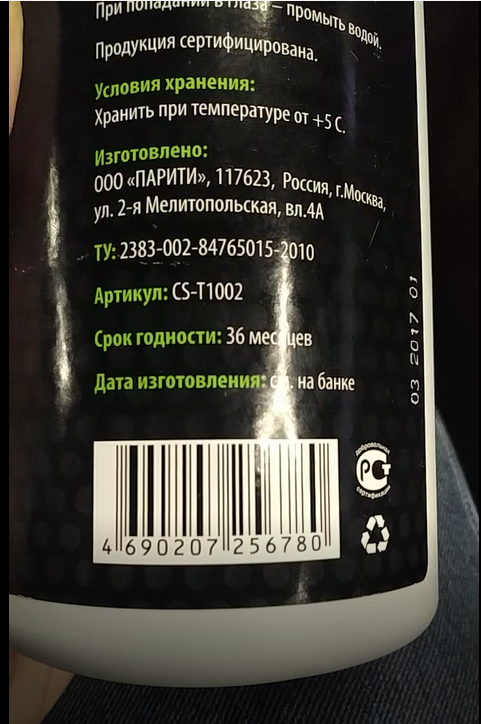

# MockApp Demo

This is a demo of the MockApp library used to inflate layouts created with 
[MockApp application](https://play.google.com/store/apps/details?id=com.crane.mockapp)

# Motivation

Traditionaly UI prototypes are created using great tools like zeplin, figma etc. Developer takes that assets and trying
to recreate UI using Android layout XML. It something changed cycle has to be repeated. We have two bunch of assets: in designing tool and Androdi XML that needs to be in sync. As we all know that the shorter the dev cycle the better.

So why we couldn't experimenting with UI right in Android UI terms (Views)? Wnen design assets become real app assets, not just a nice pictures.

# Usage

Using this tool you can:
1. Create Android UI **right in your phone (on the go!)**
2. Share it with your customer as APK **right in your phone (on the go!)**
3. Create <layout_name>.tags.txt file in your project folder and assign tags to views (or use @MockAppLayout and @MockAppView annotation see below for details). This way you create a "contract" your UI should follow to let you code work with it. 
4. Inflate layout in different ways in your app (see below for details)
5. Change your layout right in your phone and see results immediately in your app.

# Design capabilities

# Adding to Android Studio project

# Developed by
Alexey Zhuravlev ([crane2002@gmail.com](mailto:crane2002@gmail.com))

# License

    Copyright 2019 Alexey Zhuravlev
    
    Licensed under the Apache License, Version 2.0 (the "License");
    you may not use this file except in compliance with the License.
    You may obtain a copy of the License at
    
       http://www.apache.org/licenses/LICENSE-2.0
    
    Unless required by applicable law or agreed to in writing, software
    distributed under the License is distributed on an "AS IS" BASIS,
    WITHOUT WARRANTIES OR CONDITIONS OF ANY KIND, either express or implied.
    See the License for the specific language governing permissions and
    limitations under the License.

    
    
